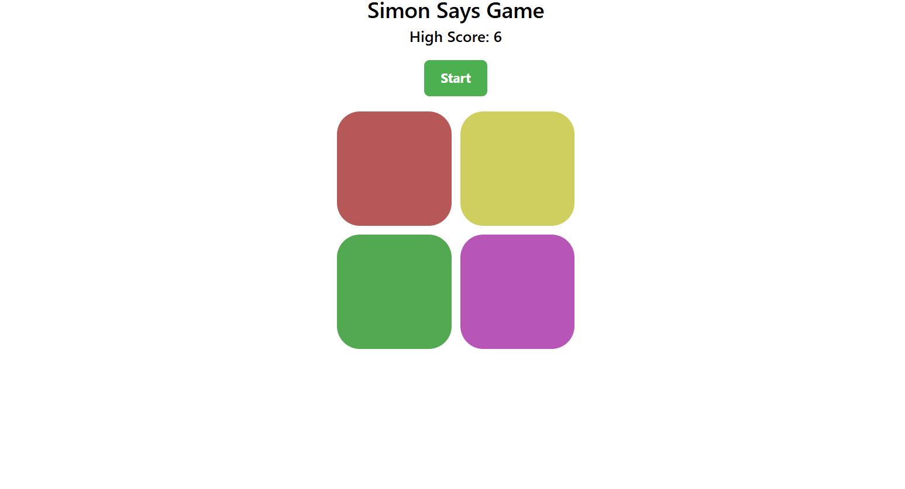

# Simon Says - A Responsive Web Game

A modern, responsive implementation of the classic "Simon Says" memory game. This project was built from scratch with a focus on clean JavaScript game logic, a mobile-first layout using the Bootstrap 5 grid, and persistent high-score tracking via browser `localStorage`.

---

## Live Demo

You can play the live, deployed version of the game here:

**[https://arsh-simon-game.netlify.app/]**

---

## Screenshot



---

## Features

- **Classic Simon Gameplay:** Follow the progressively longer and faster color sequences to test your memory.
- **Fully Responsive Design:** The 2x2 game board and UI adapt perfectly to all screen sizes, from small mobile phones to large desktops, using Bootstrap's grid system.
- **Persistent High-Score:** Your highest score is automatically saved in the browser using the `localStorage` API, so you can always come back and try to beat your record.
- **Interactive UI:** A clear "Start Game" button, distinct flash effects for the computer's sequence and the user's input, and an instant "Game Over" screen.

---

## Tech Stack

- **Frontend:** HTML5, CSS3, JavaScript (ES6+), Bootstrap 5

---

## Local Setup & Installation

This project is a static website and requires no special build steps.

1.  **Clone the repository:**

    ```bash
    git clone https://github.com/arshalik1111-design/Simon-Says-Game.git
    ```

2.  **Navigate to the project directory:**

    ```bash
    cd Simon-Says-Game
    ```

3.  **Open the application:**
    Simply open the `index.html` file in your favorite web browser to start playing.

---

## Future Enhancements

- [ ] Add a "Light Mode" / "Dark Mode" toggle.
- [ ] Implement different difficulty levels (e.g., faster sequences).
- [ ] Add sound effects for each button press.
